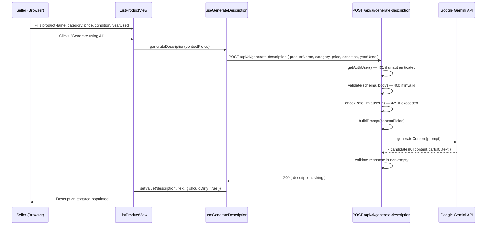

# Design Document — AI Description Generator

## Overview

This feature adds AI-powered description generation to the "List a Product" form in the Bright College Hub marketplace. A seller fills in product name, category, price, condition, and years used, then clicks "Generate using AI" to receive a 2–3 sentence polite description that is auto-populated into the description textarea.

The implementation has two distinct layers:

- **Backend**: A new Next.js API route (`POST /api/ai/generate-description`) that holds the Gemini API key server-side, validates the request, enforces rate limiting, builds the prompt, calls the Gemini API, and returns the generated text.
- **Frontend**: Modifications to `ListProductView` and `ListProductPage` — field reordering, a new `useGenerateDescription` hook, a character counter, and Generate Button UX states.

The feature is additive: the form remains fully functional for manual description entry when the AI key is absent.

---

## Architecture



### Key Architectural Decisions

**In-memory rate limiting**: A module-level `Map<string, RateLimitEntry>` in the route file stores per-user request counts and window start times. This is simple and zero-dependency. The trade-off is that the counter resets on server restart and does not share state across multiple Node.js instances (acceptable for a free-tier single-instance deployment).

**No new module**: The AI feature lives inside the existing `src/modules/user` module. The API client function goes in `src/modules/user/api/user.api.ts`, the hook in `src/modules/user/hooks/`, and the route in `src/app/api/ai/generate-description/route.ts`. No new top-level module is needed.

**Prompt construction on the server**: The prompt is built entirely in the API route, never on the client. This prevents prompt injection from client-supplied strings from bypassing server-side instructions.

---

## Components and Interfaces

### 1. API Route — `src/app/api/ai/generate-description/route.ts`

Handles `POST /api/ai/generate-description`.

```
Responsibilities:
  - Auth guard via getAuthUser()
  - Zod validation of request body
  - In-memory rate limit check
  - Prompt construction
  - Gemini API call via fetch (no SDK needed for a single endpoint)
  - Response normalisation and error mapping
```

### 2. Zod Validator — `src/backend/validators/aiDescription.validator.ts`

```typescript
// Request body schema
generateDescriptionSchema: z.object({
  productName: z.string().min(1),
  category:    z.string().min(1),
  price:       z.string().min(1),
  condition:   z.string().min(1),
  yearUsed:    z.number().int().min(0),
})

// Type alias
type GenerateDescriptionInput = z.infer<typeof generateDescriptionSchema>
```

### 3. Rate Limiter — inline in the route module

```typescript
interface RateLimitEntry {
  count: number
  windowStart: number   // Date.now() ms
}

const rateLimitStore = new Map<string, RateLimitEntry>()

const RATE_LIMIT_MAX     = 10
const RATE_LIMIT_WINDOW  = 60 * 60 * 1000   // 1 hour in ms

function checkRateLimit(userId: string): { allowed: boolean; resetAt: number }
```

`checkRateLimit` reads the entry for `userId`, resets the window if it has expired, increments the counter, and returns `{ allowed: false, resetAt }` when the count exceeds the maximum.

### 4. Prompt Builder — inline helper in the route module

```typescript
function buildPrompt(input: GenerateDescriptionInput): string
```

Returns a single string containing all five context fields and the generation instructions (2–3 sentences, polite tone, no price, plain text only).

### 5. Client API Function — `src/modules/user/api/user.api.ts` (addition)

```typescript
interface GenerateDescriptionPayload {
  productName: string
  category:    string
  price:       string
  condition:   string
  yearUsed:    number
}

interface GenerateDescriptionResponse {
  description: string
}

// Added to existing user.api.ts exports:
export const aiApi = {
  generateDescription: (payload: GenerateDescriptionPayload) =>
    apiClient.post<ApiResponse<GenerateDescriptionResponse>>(
      '/api/ai/generate-description',
      payload
    ),
}
```

### 6. Custom Hook — `src/modules/user/hooks/useGenerateDescription.ts`

```typescript
interface UseGenerateDescriptionOptions {
  setValue:    UseFormSetValue<ListProductForm>
  watch:       UseFormWatch<ListProductForm>
  isAiEnabled: boolean   // false when GEMINI_API_KEY is absent
}

interface UseGenerateDescriptionReturn {
  generate:     () => Promise<void>
  isGenerating: boolean
  canGenerate:  boolean   // true when all 5 context fields are non-empty/valid
  rateLimitedUntil: number | null   // timestamp; non-null when 429 received
}

export function useGenerateDescription(options: UseGenerateDescriptionOptions): UseGenerateDescriptionReturn
```

The hook:
1. Watches the five context fields via `watch()`.
2. Derives `canGenerate` — all five fields must be non-empty (price > 0, yearUsed ≥ 0).
3. On `generate()`, calls `aiApi.generateDescription`, then calls `setValue('description', text, { shouldDirty: true })`.
4. On error, calls `toast.error(message)`.
5. On 429, parses the reset time from the error message and sets `rateLimitedUntil`.

### 7. Updated `ListProductView` — `src/modules/user/components/ListProductView.tsx`

Props additions:

```typescript
// Added to ListProductViewProps:
isGenerating:      boolean
canGenerate:       boolean
onGenerate:        () => void
isAiEnabled:       boolean
rateLimitedUntil:  number | null
```

UI changes:
- Field order rewritten to match Requirement 1.
- Description section gains a Generate Button above the textarea.
- Character counter rendered below the textarea.
- `maxLength={500}` on the textarea (enforces hard cap via HTML attribute; also enforced in the `onChange` handler).

### 8. Updated `ListProductPage` — `src/modules/user/pages/ListProductPage.tsx`

Adds `useGenerateDescription` hook and passes new props to `ListProductView`. Also reads `isAiEnabled` from a simple check: `process.env.NEXT_PUBLIC_AI_ENABLED === 'true'` (set at build time by the presence of `GEMINI_API_KEY`).

> **Note on `isAiEnabled`**: Because `GEMINI_API_KEY` is server-only, the client cannot read it directly. The recommended approach is to set a separate `NEXT_PUBLIC_AI_ENABLED=true` variable in `.env` alongside `GEMINI_API_KEY`. When the key is absent, omit `NEXT_PUBLIC_AI_ENABLED` (or set it to `false`). This keeps the secret server-side while letting the client know whether to show the button.

---

## Data Models

### Request Body (client → API route)

```typescript
{
  productName: string   // e.g. "Advanced Calculus Textbook"
  category:    string   // e.g. "BOOKS"
  price:       string   // e.g. "25.00"
  condition:   string   // e.g. "USED"
  yearUsed:    number   // e.g. 1
}
```

### Success Response (API route → client)

```typescript
{
  code:    200,
  success: true,
  message: "OK",
  data: {
    description: string   // 2–3 sentence plain-text description
  }
}
```

### Error Response (API route → client)

```typescript
{
  code:      number,   // 400 | 401 | 429 | 502 | 503
  success:   false,
  message:   string,
  errorCode: "VALIDATION_ERROR" | "UNAUTHORIZED" | "RATE_LIMIT_EXCEEDED"
           | "AI_SERVICE_ERROR" | "AI_EMPTY_RESPONSE" | "AI_NOT_CONFIGURED",
  data:      null
}
```

### Rate Limit Store Entry (server-side, in-memory)

```typescript
interface RateLimitEntry {
  count:       number   // requests made in current window
  windowStart: number   // Date.now() when window opened
}

// Map key: userId (string from IUser._id)
const rateLimitStore = new Map<string, RateLimitEntry>()
```

### Gemini API Request (route → Gemini)

Sent via `fetch` to `https://generativelanguage.googleapis.com/v1beta/models/gemini-1.5-flash:generateContent?key={GEMINI_API_KEY}`:

```typescript
{
  contents: [
    {
      parts: [{ text: string }]   // the built prompt
    }
  ],
  generationConfig: {
    temperature:     0.7,
    maxOutputTokens: 200,
  }
}
```

### Gemini API Response (Gemini → route)

```typescript
{
  candidates: [
    {
      content: {
        parts: [{ text: string }]
      }
    }
  ]
}
```

The route extracts `candidates[0].content.parts[0].text` and trims it. If the result is empty or whitespace-only, it returns 502 `AI_EMPTY_RESPONSE`.

---

## Correctness Properties

*A property is a characteristic or behavior that should hold true across all valid executions of a system — essentially, a formal statement about what the system should do. Properties serve as the bridge between human-readable specifications and machine-verifiable correctness guarantees.*

The project already has `fast-check` installed. Properties below are written for `vitest` + `fast-check`.

### Property 1: API key never leaks in any response

*For any* request to `POST /api/ai/generate-description` — whether valid, invalid, unauthenticated, or rate-limited — the serialised response body SHALL NOT contain the value of `GEMINI_API_KEY`.

**Validates: Requirements 2.2**

### Property 2: Validation rejects any incomplete request body

*For any* non-empty subset of the five required fields (`productName`, `category`, `price`, `condition`, `yearUsed`) that is omitted from the request body, the route SHALL return HTTP 400 with `errorCode: "VALIDATION_ERROR"`.

**Validates: Requirements 2.4**

### Property 3: Prompt contains all five context fields

*For any* valid combination of `productName`, `category`, `price`, `condition`, and `yearUsed`, the string returned by `buildPrompt()` SHALL contain each of the five input values as a substring.

**Validates: Requirements 3.1**

### Property 4: AI response auto-populates the description field

*For any* non-empty description string returned by the mocked AI API, after `useGenerateDescription.generate()` resolves, the value of the `description` form field SHALL equal that string.

**Validates: Requirements 4.2**

### Property 5: Whitespace-only AI responses are rejected

*For any* string composed entirely of whitespace characters (spaces, tabs, newlines — including the empty string), when the Gemini API returns that string as its response text, the route SHALL return HTTP 502 with `errorCode: "AI_EMPTY_RESPONSE"`.

**Validates: Requirements 4.5**

### Property 6: Generate Button disabled when any context field is empty

*For any* form state where at least one of the five context fields (`productName`, `category`, `price`, `condition`, `yearUsed`) is empty or zero, the Generate Button SHALL have the `disabled` attribute.

**Validates: Requirements 5.2**

### Property 7: Overwrite on regenerate

*For any* pre-existing non-empty description value in the form and *for any* non-empty AI-generated description string, after `generate()` resolves the `description` field value SHALL equal the new AI-generated string (not the original value).

**Validates: Requirements 5.6**

### Property 8: Character counter displays correct count

*For any* string of length `n` where `0 ≤ n ≤ 500`, the character counter element SHALL display the text `"{n} / 500 characters"`.

**Validates: Requirements 6.1**

### Property 9: Character counter colour thresholds

*For any* description of length `n`:
- If `450 ≤ n ≤ 499`, the counter element SHALL have the amber/warning CSS class applied.
- If `n = 500`, the counter element SHALL have the red/error CSS class applied.
- If `n < 450`, neither the amber nor the red class SHALL be applied.

**Validates: Requirements 6.3, 6.4**

### Property 10: Rate limit enforced across all users

*For any* authenticated user who makes more than 10 requests to `POST /api/ai/generate-description` within a single one-hour window, every request after the 10th SHALL return HTTP 429 with `errorCode: "RATE_LIMIT_EXCEEDED"`.

**Validates: Requirements 8.1, 8.2**

---

## Error Handling

| Condition | HTTP Status | `errorCode` | Notes |
|---|---|---|---|
| No valid session cookie | 401 | `UNAUTHORIZED` | Via `getAuthUser()` returning null |
| Missing / invalid body fields | 400 | `VALIDATION_ERROR` | Via `validate(schema, body)` |
| Rate limit exceeded | 429 | `RATE_LIMIT_EXCEEDED` | Message includes ISO reset timestamp |
| `GEMINI_API_KEY` absent | 503 | `AI_NOT_CONFIGURED` | Checked before any Gemini call |
| Gemini network error / timeout | 502 | `AI_SERVICE_ERROR` | `fetch` throws or non-2xx status |
| Gemini returns empty/whitespace | 502 | `AI_EMPTY_RESPONSE` | After trimming the response text |

**Client-side error handling** (in `useGenerateDescription`):

- Any error response → `toast.error(message)` via `react-hot-toast`.
- 429 response → additionally parse reset time from message, set `rateLimitedUntil` state, disable the Generate Button until that timestamp passes.
- Network failure (axios throws) → `toast.error('Could not reach the server. Please try again.')`.

**Graceful degradation**:

When `NEXT_PUBLIC_AI_ENABLED` is `false` (or absent), `ListProductView` renders the Generate Button as disabled with a `title` tooltip of "AI not available". The rest of the form is unaffected.

---

## Testing Strategy

### Unit Tests — `src/modules/user/__tests__/`

Focus on pure logic that does not require a running server:

- `buildPrompt.test.ts` — verifies prompt contains all five fields and the required instructions (plain text, no price, 2–3 sentences). Uses `fast-check` for Property 3.
- `checkRateLimit.test.ts` — verifies the rate limiter allows exactly 10 requests, rejects the 11th, and resets after the window expires. Uses `fast-check` for Property 10.
- `useGenerateDescription.test.ts` — tests the hook with mocked `aiApi`. Covers Properties 4, 6, 7 using `fast-check` with `renderHook` from `@testing-library/react`.
- `ListProductView.test.tsx` — tests character counter display and colour classes. Covers Properties 8 and 9 using `fast-check`.

### Integration Tests — `src/app/api/ai/__tests__/`

Test the full route handler with mocked Gemini fetch:

- Auth guard: unauthenticated request → 401 (Example, Requirement 2.3).
- Validation: various incomplete bodies → 400 (Property 2, Requirement 2.4).
- Missing API key: unset env var → 503 (Example, Requirement 7.2).
- Gemini error: mocked fetch throws → 502 `AI_SERVICE_ERROR` (Example, Requirement 4.4).
- Gemini empty response: mocked fetch returns whitespace → 502 `AI_EMPTY_RESPONSE` (Property 5, Requirement 4.5).
- Happy path: valid request + mocked Gemini → 200 `{ description }` (Example, Requirement 4.1).
- API key leak: Property 1 — `fast-check` generates varied inputs, asserts key never appears in response body.

### Property-Based Test Configuration

- Library: `fast-check` (already installed as a dev dependency).
- Test runner: `vitest` (already configured with `npm test`).
- Minimum iterations: 100 per property test (fast-check default is 100).
- Tag format in test comments: `// Feature: ai-description-generator, Property {N}: {property_text}`

### What is NOT tested with PBT

- CSS layout / responsive breakpoints (Requirement 1.2–1.4): manual or visual regression.
- Toast notification rendering (Requirement 5.5, 8.3): example-based with mocked `react-hot-toast`.
- `NEXT_PUBLIC_AI_ENABLED` degradation UI (Requirement 7.3): example-based component test.
- Documentation presence (Requirement 7.4): manual review.
